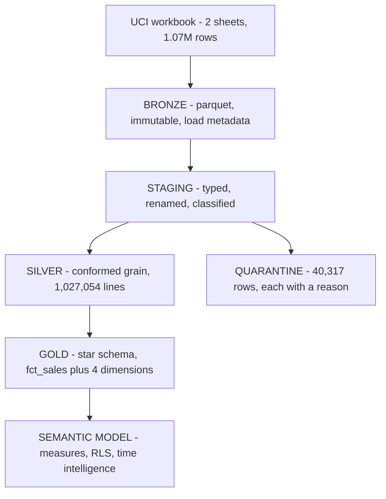

# Retail Analytics Platform

A medallion-architecture analytics pipeline over ~1.07 million retail transactions,
built as an **analytics engineering** project rather than a dashboard project: the
data is versioned, the transformations are tested, and every cleaning decision is
auditable.

[](https://github.com/avixd/retail-analytics-platform/actions/workflows/dbt.yml)

> **Demo project.** Built on a public dataset under CC BY 4.0. No employer data, no
> client data, nothing proprietary.

---

## 1. Business Problem

A retailer has two years of transactions and cannot confidently answer basic
questions about its own business, because nobody has established what counts as a
sale.

### The questions this has to answer

| # | Question | Blocked by |
|---|---|---|
| Q1 | What did we actually sell, net of cancellations and returns? | Returns and cancellations are mixed into the same column as sales |
| Q2 | Which products and countries drive revenue? | No product master; 1,207 products have conflicting names |
| Q3 | Who are our repeat customers, and are we retaining them? | 23% of lines have no customer identifier at all |
| Q4 | Which "sales" are not sales? | Postage, bank charges and vouchers carry product codes |
| Q5 | Can we trust any number we publish? | No lineage, no tests, no record of what was cleaned away |

### Why it matters

- **Revenue is misstated without a decision on duplicates.** The duplicate question
  alone is worth **£496,886 — 2.39% of gross**. Reported either way without a stated
  rule, the number is indefensible.
- **A fifth of the business disappears on the easy path.** Dropping rows with no
  customer ID is the obvious cleaning move and silently discards **22.7% of lines**.
- **Product analysis is quietly wrong** while postage and bank charges sit in the
  same table as products.
- **Un-auditable numbers get overturned in the room.** A figure nobody can trace
  loses to whoever has a spreadsheet and more confidence.

The deliverable is not a dashboard. It is a **defensible definition of a sale**,
implemented as tested code.

---

## 2. Solution Overview

### Scope

**In scope**

- Ingestion from source with reproducible, checksummed download
- Medallion layering: bronze (raw), silver (conformed), gold (dimensional)
- Explicit, tested handling of duplicates, returns, guests and non-products
- A star schema ready for a semantic layer
- Automated data quality testing in CI
- A documented mapping to Microsoft Fabric

**Out of scope**

- Real-time or incremental ingestion — the source is a static historical extract
- Machine learning, forecasting, propensity scoring
- Orchestration beyond CI — no Airflow or Dagster for a single daily-equivalent run
- Cost, margin or profitability — the source carries price, not cost

### Assumptions

| # | Assumption | Basis | If wrong |
|---|---|---|---|
| A1 | Invoices prefixed `C` are cancellations | Documented by the data publisher | Returns misclassified; net revenue overstated |
| A2 | Rows identical on invoice, product, timestamp, quantity and price are artefacts | 32,909 such groups share a timestamp to the second | Revenue understated by £496,886 |
| A3 | Stock codes not matching 5 digits are not products | Inspection: POST, DOT, BANK CHARGES, gift vouchers | Per-product measures contaminated |
| A4 | Rows with no customer ID are guest checkouts, not errors | Consistent across both years, ~23% throughout | Retention analysis skewed |
| A5 | A product's most frequently used description is its real name | Frequency tracks the settled name; recency alone lets one typo rename it | Product labels wrong in reports |
| A6 | Country belongs to the order, not the customer | 12 customers transact from more than one country | Geographic revenue misattributed |

### Pros and cons

**What this approach buys**

- **Auditable** — nothing is deleted; every excluded row is retrievable with a reason
- **Reproducible** — a clone rebuilds the entire warehouse from source in CI
- **Tested at the boundaries** — 50 tests, including reconciliation between layers
- **Portable** — runs free on any machine; no cloud account, no capacity, no licence
- **Honest** — the expensive decisions are stated up front, not buried in a transform

**What it costs, and the trade accepted**

| Limitation | Why it was accepted |
|---|---|
| DuckDB is single-node | 1.07M rows is small. Distributed compute would be theatre. |
| Full rebuild, not incremental | The source is static. Incremental logic would add risk for no benefit. |
| Type 1 dimensions only | The source has no history to preserve — type 2 would invent it. |
| Not built on Fabric | No capacity available. The architecture maps cleanly; see section 5. |
| No cost or margin data | Not in the source. Inventing a margin would be fabrication. |

---

## 3. High-Level Architecture



Each layer has exactly one job, and the boundary between them is enforced by a test.

| Layer | Responsibility | Rule that defines it |
|---|---|---|
| Bronze | Land it, change nothing | No business logic whatsoever |
| Staging | Type, rename, classify | Still reconciles to bronze row for row |
| Silver | Conform and clean | Nothing deleted; removals go to quarantine |
| Gold | Model dimensionally | Star schema, no orphans, revenue reconciles |

---

## 4. Technical and Functional Requirements

### 4.1 Functional requirements

| ID | Requirement | Where it is met | Verified by |
|---|---|---|---|
| F1 | Source data retrieved reproducibly with integrity check | `scripts/download.py` | SHA-256 recorded; truncated downloads rejected |
| F2 | Raw data preserved unmodified with lineage metadata | `scripts/ingest_bronze.py` | `_manifest.json`, source hash on every row |
| F3 | Bronze reconciles to the source workbook | `scripts/profile_bronze.py` | Counts read from worksheet dimensions independently |
| F4 | Sales, cancellations and adjustments distinguished | `stg_online_retail.sql` | `accepted_values` test on `line_type` |
| F5 | Duplicates resolved by a stated, evidenced rule | `silver_order_lines.sql` | Quarantined with reason; impact quantified |
| F6 | Guest checkouts retained, not discarded | `silver_order_lines.sql` | `UNKNOWN` member; `is_guest` flag |
| F7 | Non-products excluded from the product grain | `silver_order_lines.sql` | Quarantined with reason |
| F8 | Every excluded row recoverable and explained | `silver_rejected_lines.sql` | `not_null` + `accepted_values` on `reject_reason` |
| F9 | Conformed dimensional model for BI consumption | `models/gold/` | Relationship tests on all four dimensions |
| F10 | Contiguous date dimension for time intelligence | `dim_date.sql` | Generated, not derived; uniqueness tested |
| F11 | Gold consumable by Power BI without a live database | `scripts/export_gold.py` | Five parquet files, 32 MB |

### 4.2 Technical requirements

| ID | Requirement | Implementation |
|---|---|---|
| T1 | Fully reproducible on a clean machine | CI rebuilds from source on every push |
| T2 | No credentials or secrets anywhere in the repo | DuckDB is a local file; `profiles.yml` is committed safely |
| T3 | No telemetry from developer machines or CI | `send_anonymous_usage_stats: false` |
| T4 | Data never committed | `data/`, `target/`, `logs/`, `.user.yml` all ignored |
| T5 | Transformations version-controlled and reviewable | SQL models in git; lineage via `dbt docs` |
| T6 | Pipeline fails loudly on data quality regression | `dbt build` halts on test failure; verified by breaking it |
| T7 | Deterministic dependencies | `requirements.txt` and `package-lock.yml` pinned |

### 4.3 Data quality rules

| Rule | Type | Result |
|---|---|---|
| `silver + quarantine = staging` | Reconciliation | 1,027,054 + 40,317 = 1,067,371 |
| Gold revenue equals silver revenue | Reconciliation | Equal to within £0.01 |
| No fact row without a matching dimension | Referential | Zero orphans on all four |
| Surrogate keys unique and non-null | Integrity | Enforced on every table |
| `line_type` within its allowed set | Domain | sale / cancellation / adjustment |
| `reject_reason` always populated | Completeness | No unexplained exclusions |

**Total: 50 automated tests**, run on every push.

> The reconciliation test has been **deliberately broken and confirmed to fail**.
> A green badge that cannot go red proves nothing.

### 4.4 The decisions, in detail

**Duplicates — collapsed, worth £496,886.** 34,335 rows repeat an identical invoice,
stock code, timestamp, quantity, price and customer. What settled it: **32,909 of
those groups share a timestamp to the second**, which a till does not produce for
separate scans. The counter-evidence was checked too — 11,158 invoice/product pairs
legitimately repeat with *different* quantity or price, which is why the dedupe key
includes both rather than just invoice and product.

**Guest checkouts — kept, 22.7% of lines.** 243,007 lines have no customer ID.
Dropping them would misstate the business by almost a quarter. They collapse into one
`UNKNOWN` member, explicitly flagged.

**Non-products — quarantined, 5,980 rows.** Postage, bank charges, samples, vouchers
and manual adjustments carry stock codes but are not products.

### 4.5 The star schema

| Table | Grain | Rows |
|---|---|---|
| `fct_sales` | One order line | 1,027,054 |
| `dim_customer` | One customer, plus `UNKNOWN` | 5,877 |
| `dim_product` | One stock code (type 1) | 5,243 |
| `dim_country` | One country | 43 |
| `dim_date` | One day, contiguous | 1,095 |

Dimension problems resolved rather than ignored: 1,207 stock codes with conflicting
descriptions (most-frequent wins, most-recent breaks ties); 335 with no description
(labelled, not blanked); 12 customers spanning countries (country lives on the fact).

**Net sales after cleaning: £18,925,714.33.**

---

## 5. Mapping to Microsoft Fabric

Built on a local open-source stack. The architecture is the one I would deploy on
Fabric, stated plainly so nothing is overclaimed:

| This project | Fabric equivalent |
|---|---|
| Parquet bronze / silver / gold | Lakehouse with medallion schemas |
| dbt-duckdb models | Data Factory pipelines and notebooks |
| dbt tests | Data quality rules |
| `dbt docs` lineage | Fabric lineage view |
| Gold parquet to Power BI | Direct Lake over the Lakehouse |
| `profiles.yml` targets | Workspace environments |

The engineering practice — layered responsibility, tested boundaries, auditable
cleaning, source-controlled transformations — is identical. Only the runtime differs.

---

## 6. Documentation

| Document | Contents |
|---|---|
| This README | Problem, scope, assumptions, architecture, requirements |
| [`docs/bronze-profile.json`](docs/bronze-profile.json) | Generated data profile: counts, nulls, date range, non-product codes |
| `models/**/*.sql` | Every model carries a header explaining the decision it makes |
| `models/**/_*.yml` | Column-level descriptions and test definitions |
| `dbt docs generate` | Full lineage graph and column-level documentation |
| CI run log | Proof the pipeline rebuilds from source |

### The data

[UCI Online Retail II](https://doi.org/10.24432/C5CG6D) — a UK online retailer,
December 2009 to December 2011. 1,067,371 rows, 53,628 invoices, 5,305 stock codes,
43 countries. Licensed **CC BY 4.0**. The raw file is not committed;
`scripts/download.py` fetches it and records a SHA-256.

### Running it

```bash
python -m venv .venv && .venv/Scripts/activate   # or source .venv/bin/activate
pip install -r requirements.txt

python scripts/download.py        # fetch and verify the source (~46 MB)
python scripts/ingest_bronze.py   # land to parquet
python scripts/profile_bronze.py  # reconcile against the workbook, profile
dbt deps && dbt build             # staging -> silver -> gold, 50 tests
python scripts/export_gold.py     # parquet for the semantic layer
```

`DBT_PROFILES_DIR` should point at the repo root.

### Stack

**Python** · **DuckDB** · **dbt** (dbt-duckdb) · **Parquet** · **Power BI** ·
**GitHub Actions**

---

## Licence

All rights reserved. Published for viewing and evaluation only — see [LICENSE](LICENSE).
Source data © UCI Machine Learning Repository, CC BY 4.0.
