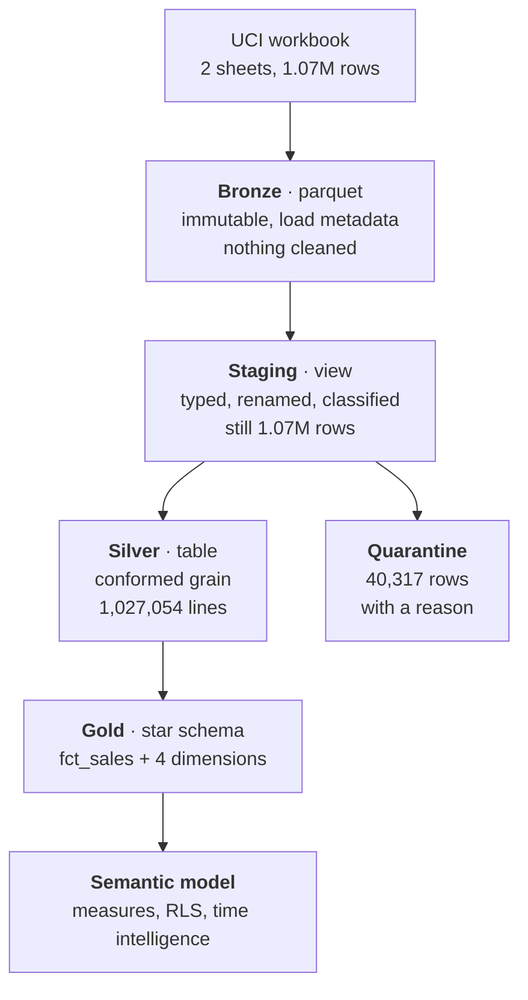

# Retail Analytics Platform

A medallion-architecture analytics pipeline over ~1.07 million retail transactions,
built as an **analytics engineering** project rather than a dashboard project: the
data is versioned, the transformations are tested, and every cleaning decision is
auditable.

[](https://github.com/avixd/retail-analytics-platform/actions/workflows/dbt.yml)

> **Demo project.** Built on a public dataset under CC BY 4.0. No employer data,
> no client data, nothing proprietary.

## The problem

Retail transaction data arrives as a flat invoice extract: one row per line, no
dimensions, no product master, and no indication of which rows are real. Before any
question about revenue, retention or product performance can be answered honestly,
someone has to decide what counts as a sale — and be able to show their working.

This project is that decision-making, made explicit and testable.

## The data

[UCI Online Retail II](https://doi.org/10.24432/C5CG6D) — a UK online retailer,
December 2009 to December 2011. **1,067,371 rows**, 53,628 invoices, 5,305 stock
codes, 43 countries. Licensed **CC BY 4.0**.

The raw file is not committed. `scripts/download.py` fetches it and records a
SHA-256, so every run is reproducible from source.

## Architecture



Each layer has one job, and the boundary between them is a test.

| Layer | Responsibility | Rule |
|---|---|---|
| Bronze | Land it, change nothing | No business logic whatsoever |
| Staging | Type, rename, classify | Still reconciles to bronze row for row |
| Silver | Conform and clean | Nothing deleted — removed rows go to quarantine |
| Gold | Model dimensionally | Star schema, no orphans, revenue reconciles |

## The decisions

This is the part that matters. Three cleaning judgements changed the numbers
materially, and each is recorded in the model that makes it.

### Duplicates — collapsed, worth £496,886

34,335 rows repeat an identical invoice, stock code, timestamp, quantity, price and
customer. Collapsing them moves gross sales by **£496,886 (2.39%)** — far too
material to do quietly.

What settled it: **32,909 of those groups share a timestamp to the second.** A till
does not record twenty separate scans within the same second, so they read as an
extract artefact rather than genuine repeat lines. They are collapsed — and written
to `silver_rejected_lines` with a reason, not deleted.

The counter-evidence was checked too: 11,158 invoice/product pairs legitimately
repeat with *different* quantity or price. Those are untouched, which is why the
dedupe key includes quantity and price rather than just invoice and product.

### Guest checkouts — kept, 22.7% of lines

243,007 lines have no customer ID. Dropping them is the easy move and would
misstate the business by almost a quarter. They are kept and routed to a single
`UNKNOWN` customer, explicitly flagged — visible in any report rather than silently
absent.

### Non-products — quarantined, 5,980 rows

Postage, bank charges, samples, gift vouchers and manual adjustments carry stock
codes but are not products. Left in, they corrupt every per-product measure. They
are excluded from the line grain and retained in quarantine.

### The test that holds it together

```
silver_order_lines + silver_rejected_lines = stg_online_retail
      1,027,054     +        40,317        =      1,067,371
```

Cleaning is only trustworthy if nothing vanished unaccounted for. This assertion
runs on every build, and **it has been verified to fail** when quarantine logic is
broken — a test that cannot go red proves nothing.

## The star schema

| Table | Grain | Rows |
|---|---|---|
| `fct_sales` | One order line | 1,027,054 |
| `dim_customer` | One customer, plus an UNKNOWN member | 5,877 |
| `dim_product` | One stock code (type 1) | 5,243 |
| `dim_country` | One country | 43 |
| `dim_date` | One day, contiguous | 1,095 |

Dimension problems resolved rather than ignored:

- **1,207 stock codes carry conflicting descriptions.** Most-frequent wins, most-recent
  breaks ties — frequency tracks the settled name, while recency alone lets one late
  typo rename a product.
- **335 stock codes have no description at all.** Labelled `(no description)` so they
  are visibly unknown rather than blank.
- **12 customers transact from more than one country.** Country is therefore an
  attribute of the *order*; the fact carries it, and the customer dimension records
  only the most recent alongside a `has_multiple_countries` flag.

Net sales after cleaning: **£18,925,714.33**.

## Running it

```bash
python -m venv .venv && .venv/Scripts/activate   # or source .venv/bin/activate
pip install -r requirements.txt

python scripts/download.py        # fetch + verify the source (~46 MB)
python scripts/ingest_bronze.py   # land to parquet
python scripts/profile_bronze.py  # reconcile against the workbook, profile
dbt deps && dbt build             # staging -> silver -> gold, with 50 tests
python scripts/export_gold.py     # parquet for the semantic layer
```

`DBT_PROFILES_DIR` should point at the repo root. `profiles.yml` is committed
deliberately — DuckDB is a local file, so there are no secrets in it and a fresh
clone runs with no setup.

## How this maps to Microsoft Fabric

Built on a local open-source stack, but the architecture is the one I would deploy
on Fabric. Stated plainly so the mapping is not overclaimed:

| This project | Fabric equivalent |
|---|---|
| Parquet bronze / silver / gold | Lakehouse with medallion schemas |
| dbt-duckdb models | Data Factory pipelines / notebooks |
| dbt tests | Data quality rules |
| `dbt docs` lineage | Fabric lineage view |
| Gold parquet → Power BI | Direct Lake over the Lakehouse |
| `profiles.yml` targets | Workspace environments |

The engineering practice — layered responsibility, tested boundaries, auditable
cleaning, source-controlled transformations — is identical. Only the runtime differs.

## Stack

**Python** · **DuckDB** · **dbt** (dbt-duckdb) · **Parquet** · **Power BI** ·
**GitHub Actions**

## Licence

All rights reserved. Published for viewing and evaluation only — see [LICENSE](LICENSE).
Source data © UCI Machine Learning Repository, CC BY 4.0.
